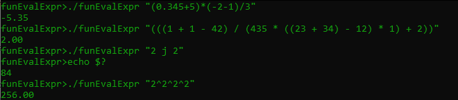

#  :heavy_division_sign: Functional Expression Evaluator

## Table of contents
* [Introduction](#introduction)
* [Program Layout](#program-layout)
* [Setup](#setup)
* [Examples](#examples)

## Introduction
This project was a school assignment focused on parsing in the Haskell programming language. The program takes in an expression through a command line argument and gives the result if the expression was valid and otherwise exits with exit code 84.

The program handles:
* Floats and Integers
* Binary Operations
  * Addition (+) and Subtraction (-)
  * Multiplication (*) and Division (/)
  * Powers (^)
* Parentheses

## Program Layout

As specified earlier, the focus of this project was to become more familiar with the parsing capabilities of the Haskell programming language. The following diagram shows the flow of development during the project. The input stream is first transformed into a list of tokens. That list of tokens is then parsed to form an expression tree which is then evaluated if the expression was valid.


All parser and combinator logic was built around the following type:
```haskell
newtype TkParser a = TkParser {
    parse :: [Token] -> Maybe (a, [Token])
}
```

## Setup
```
$ cd ./funEvalExpr
$ make
```

## Examples


